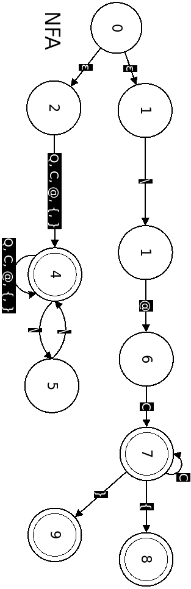
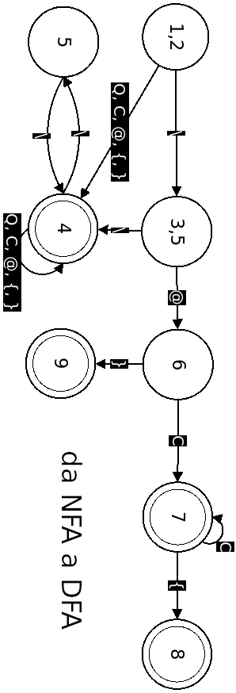
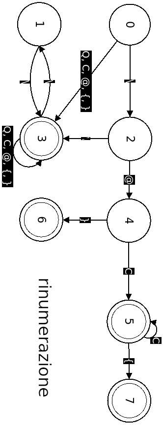
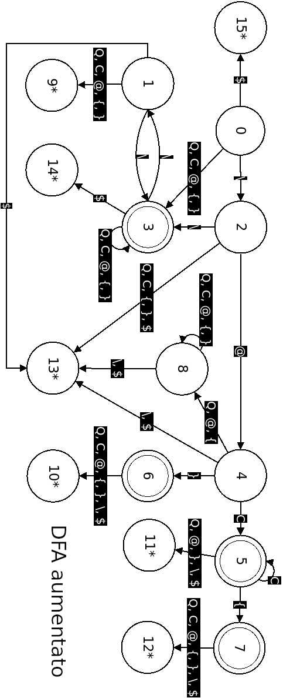

## Lexer

### Espressioni regolari

- Token CHIAVE_SEGNAPOSTO $\rightarrow$ \\\\@[A-Za-z0-9\.-_]
- Token CHIAVE_PULSANTE_OPEN $\rightarrow$ \\\\@[A-Za-z0-9\.-_]{
- Token CHIAVE_PULSANTE_CLOSE $\rightarrow$ \\\\@}
- Token CONTENUTO: Tutte le altre stringhe

- Lo stato 4 riconosce il token CONTENUTO
- Lo stato 7 riconosce il token CHIAVE_SEGNAPOSTO
- Lo stato 8 riconosce il token CHIAVE_PULSANTE_OPEN
- Lo stato 9 riconosce il token CHIAVE_PULSANTE_CLOSE

### Transizioni per la trasformazione dell'NFA a DFA

- $\epsilon(0) = \left\{1, 2\right\}$
- $\delta\left(\left\{1, 2\right\}, \text{'\textbackslash'}\right) = \left\{3, 5\right\}$
- $\delta\left(\left\{1, 2\right\}, \text{'@'}\right) = \left\{4\right\}$
- $\delta\left(\left\{1, 2\right\}, \text{'\{'}\right) = \left\{4\right\}$
- $\delta\left(\left\{1, 2\right\}, \text{'\}'}\right) = \left\{4\right\}$
- $\delta\left(\left\{1, 2\right\}, \text{'C'}\right) = \left\{4\right\}$
- $\delta\left(\left\{1, 2\right\}, \text{'Q'}\right) = \left\{4\right\}$
- $\delta\left(\left\{3, 5\right\}, \text{'\textbackslash'}\right) = \left\{4\right\}$
- $\delta\left(\left\{3, 5\right\}, \text{'@'}\right) = \left\{6\right\}$
- $\delta\left(\left\{4\right\}, \text{'\textbackslash'}\right) = \left\{5 \right\}$
- $\delta\left(\left\{4\right\}, \text{'@'}\right) = \left\{4\right\}$
- $\delta\left(\left\{4\right\}, \text{'\{'}\right) = \left\{4\right\}$
- $\delta\left(\left\{4\right\}, \text{'\}'}\right) = \left\{4\right\}$
- $\delta\left(\left\{4\right\}, \text{'C'}\right) = \left\{4\right\}$
- $\delta\left(\left\{4\right\}, \text{'Q'}\right) = \left\{4\right\}$
- $\delta\left(\left\{6\right\}, \text{'\}'}\right) = \left\{9\right\}$
- $\delta\left(\left\{6\right\}, \text{'C'}\right) = \left\{7\right\}$
- $\delta\left(\left\{5\right\}, \text{'\textbackslash'}\right) = \left\{4\right\}$
- $\delta\left(\left\{7\right\}, \text{'\{'}\right) = \left\{8\right\}$
- $\delta\left(\left\{7\right\}, \text{'C'}\right) = \left\{7\right\}$

#### Forma tabellare

S | \ | @ | { | } | C | Q 
:----:|:-:|:-:|:-:|:-:|:-:|:-:
$\left\{1, 2\right\}$ | $\left\{3, 5\right\}$ | \left\{4\right\} | \left\{4\right\} | \left\{4\right\} | \left\{4\right\} | \left\{4\right\} | \left\{4\right\} |
$\left\{3, 5\right\}$ |  \left\{4\right\} | \left\{6\right\}
$\left\{4\right\}$ |  \left\{5\right\} | \left\{4\right\} | \left\{4\right\} | \left\{4\right\} | \left\{4\right\} | \left\{4\right\} |
$\left\{5\right\}$ | \left\{4\right\}
$\left\{6\right\}$ | | | | \left\{9\right\} | \left\{7\right\}
$\left\{7\right\}$ | | | \left\{8\right\} | | \left\{7\right\} 
$\left\{8\right\}$ | 
$\left\{9\right\}$ |

### DFA Aumentato

- Lo stato 15 restituisce il token $ (end of input)
- Lo stato  9 ripone l'ultimo carattere analizzato nell'input e restituisce il token CONTENUTO
- Lo stato 14 restituisce il token CONTENUTO
- Lo stato 13 restituisce un token SCONOSCIUTO, cioè un token non valido (gestione dell'errore)
- Lo stato 11 restituisce il token CHIAVE_SEGNAPOSTO
- Lo stato 12 restituisce il token CHIAVE_PULSANTE_OPEN
- Lo stato 10 restituisce il token CHIAVE_PULSANTE_CLOSE

## Parser

### Grammatica LL1

0. T $\rightarrow$ \<CONTENUTO\> \<T\>
1. T $\rightarrow$ \<CHIAVE_SEGNAPOSTO\> \<T\>
2. T $\rightarrow$ \<CHIAVE_PULSANTE_OPEN\> \<T\> \<CHIAVE_PULSANTE_CLOSE\> \<T\>
3. T $\rightarrow \epsilon$

### Tabella Nullable, First e Follow

NT | Nullable | First | Follow
:--:|:--:|:--:|:--:
T |  true | \<CONTENUTO\>, \<CHIAVE_SEGNAPOSTO\>, \<CHIAVE_PULSANTE_OPEN\> | \<CHIAVE_PULSANTE_CLOSE\>, \$

### Predictive parse table
 NT | \<CONTENUTO\> | \<CHIAVE_SEGNAPOSTO\> | \<CHIAVE_PULSANTE_OPEN\> | \<CHIAVE_PULSANTE_CLOSE\> | \<SCONOSCIUTO\> | \$
:--:|:--:|:--:|:--:|:--:|:--:|:--:
**T** | 0 | 1 | 2 | 3 | ERRORE | 3
